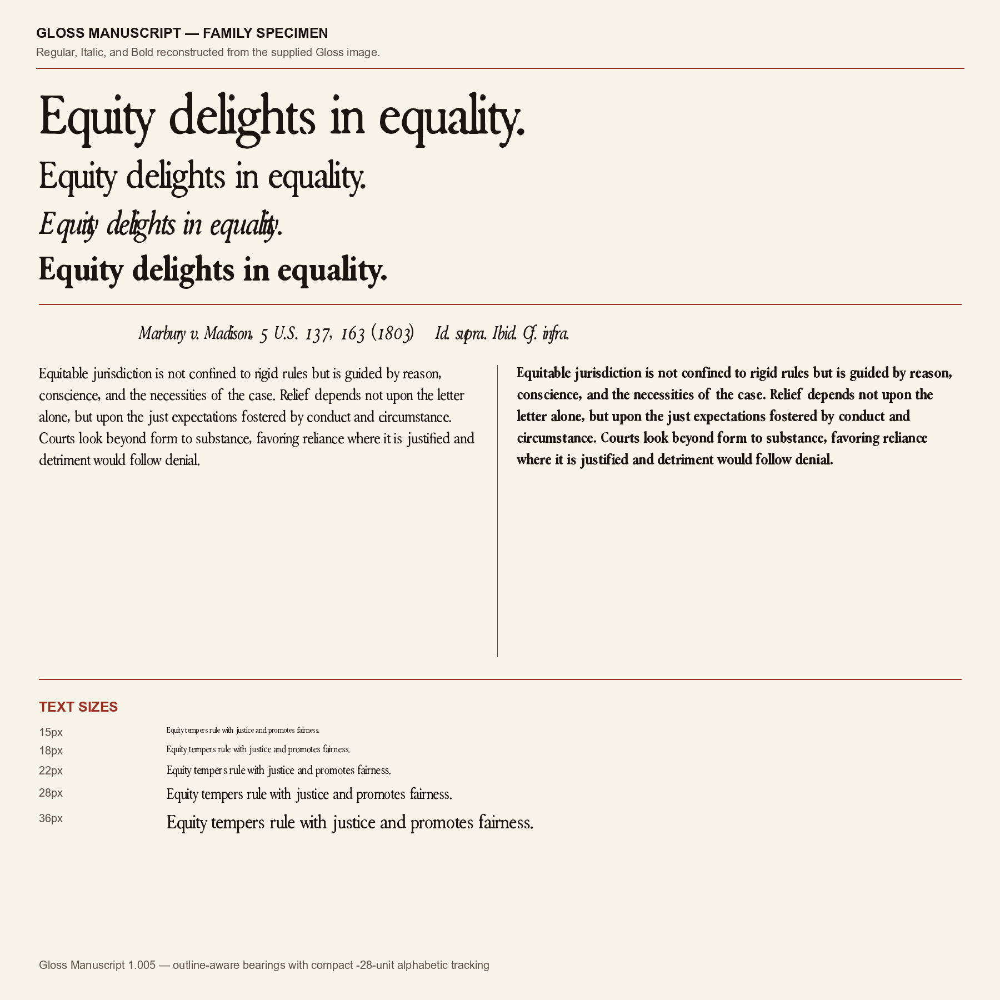

# Gloss Manuscript

Gloss Manuscript is an open-source serif family for legal, editorial, and long-form reading. It includes three coordinated styles:



- Regular
- Italic
- Bold

The family was drawn as a custom project from a commissioned raster design. No third-party font binary or donor font outline was incorporated into the build. Version 1.005 uses normalized left/right sidebearings and kerning from Windows Garamond 2.40 as an optical-spacing reference, retains the Gloss outlines' own ink widths, and applies compact -28-unit alphabetic tracking; it does not contain Garamond outlines.

## Download

Desktop TrueType fonts are in [`fonts/ttf`](fonts/ttf). Webfonts are in [`fonts/woff2`](fonts/woff2).

## Specimens

- [Long-reading proof](specimens/Gloss-Manuscript-Long-Reading-Proof.pdf) — ten pages of selectable, embedded text
- [Family specimen and QA proof](specimens/Gloss-Manuscript-Specimen.pdf) — character sets, features, comparisons, and working sizes
- [Word no-kerning spacing test](specimens/Gloss-Manuscript-Word-Spacing-Test.docx) — live-text application proof at normal character spacing and 100% scale
- [Version 1.004 spacing-model proof](specimens/Gloss-Manuscript-spacing-model-v1.004.png) — unkerned Word-like comparison of the former and corrected models
- [Version 1.005 compact-tracking proof](specimens/Gloss-Manuscript-tracking-model-v1.005.png) — before/after and three-style QA with kerning disabled

## Features

- Regular, Italic, and Bold
- Extended Latin coverage
- Kerning and mark positioning
- Standard and discretionary ligatures
- Small caps
- Oldstyle and lining figures
- Superior and inferior figures
- Fractions
- TTF and WOFF2 formats

## Install

### Windows

Open `fonts/ttf`, select the three `.ttf` files, right-click, and choose **Install** or **Install for all users**.

### macOS

Open each `.ttf` file in Font Book and select **Install Font**.

### Linux

Copy the `.ttf` files to `~/.local/share/fonts/` and run `fc-cache -f`.

### Web

```css
@font-face {
  font-family: "Gloss Manuscript";
  src: url("fonts/woff2/GlossManuscript-Regular.woff2") format("woff2");
  font-style: normal;
  font-weight: 400;
}

@font-face {
  font-family: "Gloss Manuscript";
  src: url("fonts/woff2/GlossManuscript-Italic.woff2") format("woff2");
  font-style: italic;
  font-weight: 400;
}

@font-face {
  font-family: "Gloss Manuscript";
  src: url("fonts/woff2/GlossManuscript-Bold.woff2") format("woff2");
  font-style: normal;
  font-weight: 700;
}
```

## Version

Version 1.005, released 18 July 2026. This release tightens every alphabetic advance by 28 units per em after outline-aware sidebearing matching. The result is a deliberately compact text color in Word even when pair kerning is disabled. Word-space and figure widths remain unchanged.

## License

The font software is licensed under the [SIL Open Font License, Version 1.1](OFL.txt), with **Gloss Manuscript** as a Reserved Font Name.
